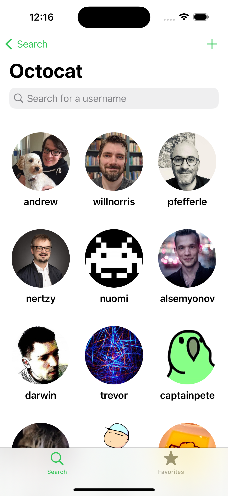
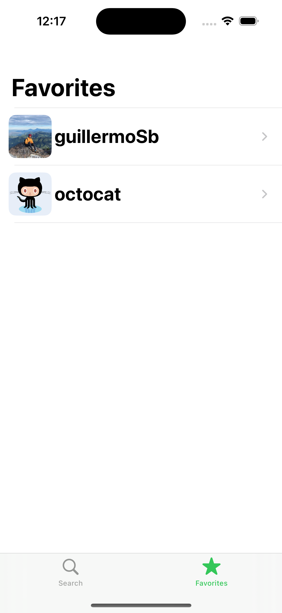
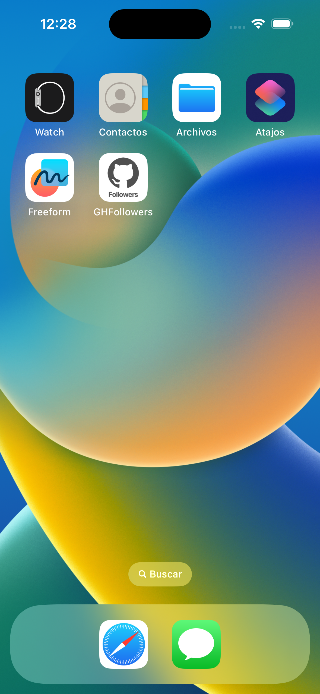

# Github Followers
An iOS application made with UIKit that allows you to track any user's Github Followers. I made this project following a course by Sean Allen on [Teachable]([http](https://seanallen.teachable.com/courses/)).

## Features
  ✅  Search for followers by username.
    
  ✅  View user details.
    
  ✅  Add user to your favorites. 

## Screenshots
Search Screen            |  Results
:-------------------------:|:-------------------------:
  |  

User Details          |  Favorites
:-------------------------:|:-------------------------:
  |  

Add a Favorite | App Icon
:-------------------------:|:-------------------------:
 |  

## Technologies Used
- UIKit Programmatic view (No StoryBoards)
- UserDefaults
- SwiftUI Integration with UIKit
- Custom layout for iPhoneSE
- Network Requests
